# SudokuGames
# Introduction
The games were developed by a group of undergraduate students of the Department of Computer Science of the Aristotle University of Thessaloniki.

# Game description
SudokuGames consists of three games the Classic Sudoku , the Killer Sudoku , the Duidoku with the aim of player to be able to enjoy all the games that comprise Sudoku in one application and to be able to choose to play each game with letters or numbers. Below will be an analysis of each game individually.

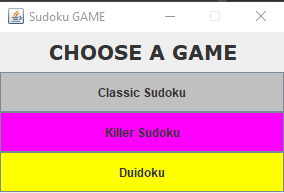
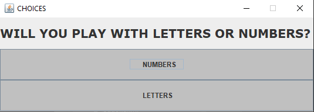

# Classic Sudoku
Classic Sudoku is the most popular version of Sudoku. More specifically, Sudoku is a logic-based puzzle. The objective is to fill in all the boxes on the board (9x9) so that each column, each row and each 3x3 box contains all the digits from 1 to 9. However, some boxes are already filled in so that there is only one possible solution.

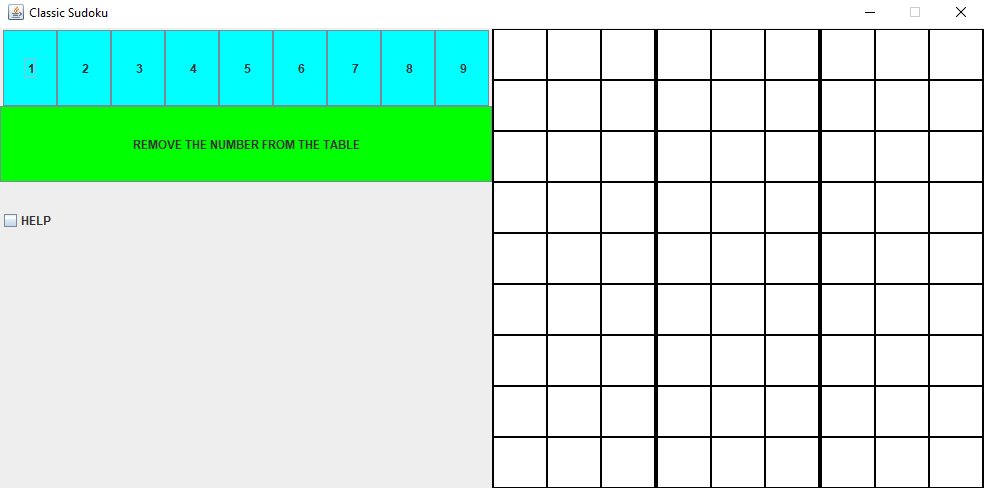
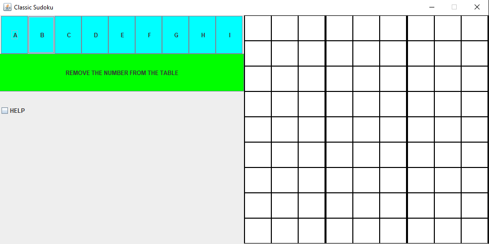

# Killer Sudoku
Killer Sudoku is a variant of the puzzle that combines elements from Sudoku and Kakuro. Despite its name, Killer Sudoku is easier to solve than the classic Sudoku because it includes mental arithmetic in its boxes. Of course, this also depends on the solver's ability in arithmetic operations.

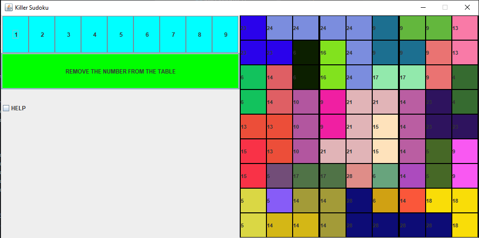

# Duidoku
Duidoku is a competitive variant of Sudoku and allows the user to compete against the AI character. More specifically, it consists of 4x4 boxes and the winner is the player who parries the last move. In addition, this game also features help to make it easier for the user in case he or she has difficulty beating the AI character.

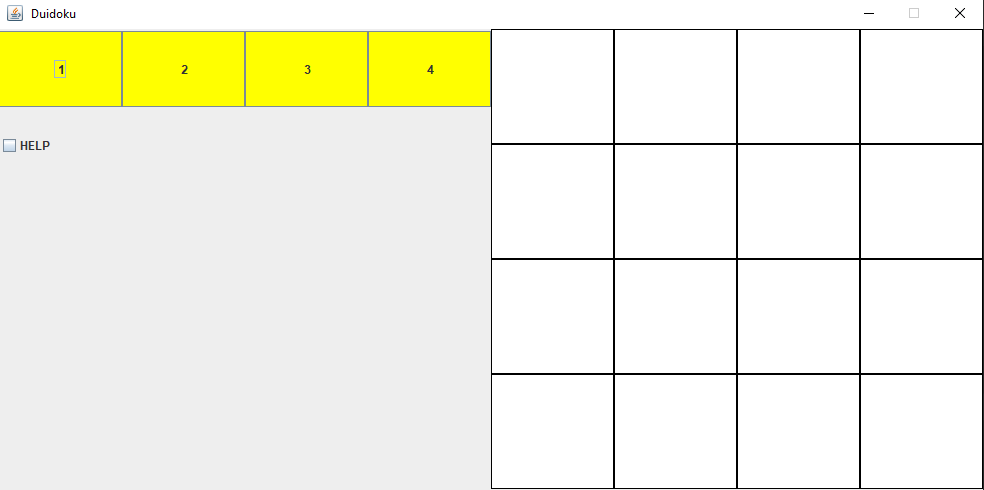
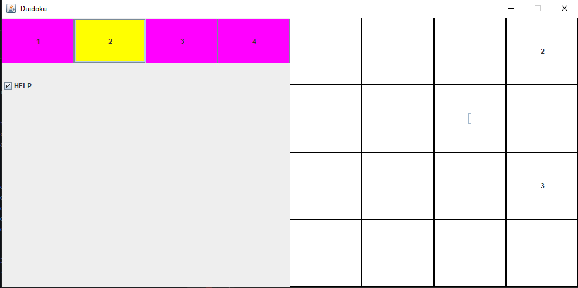
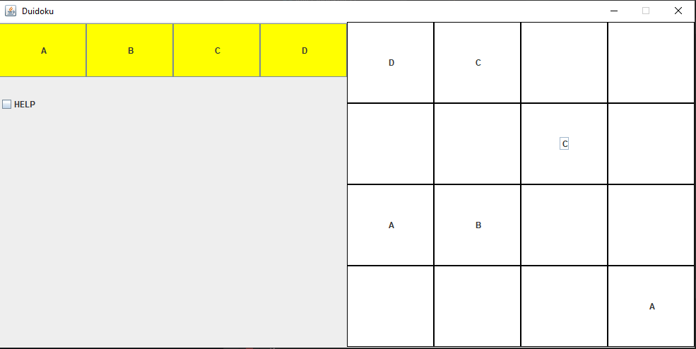
<!---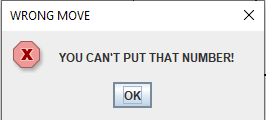
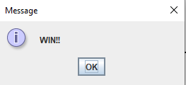
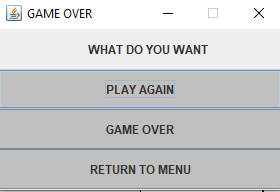

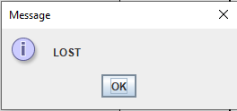-->

